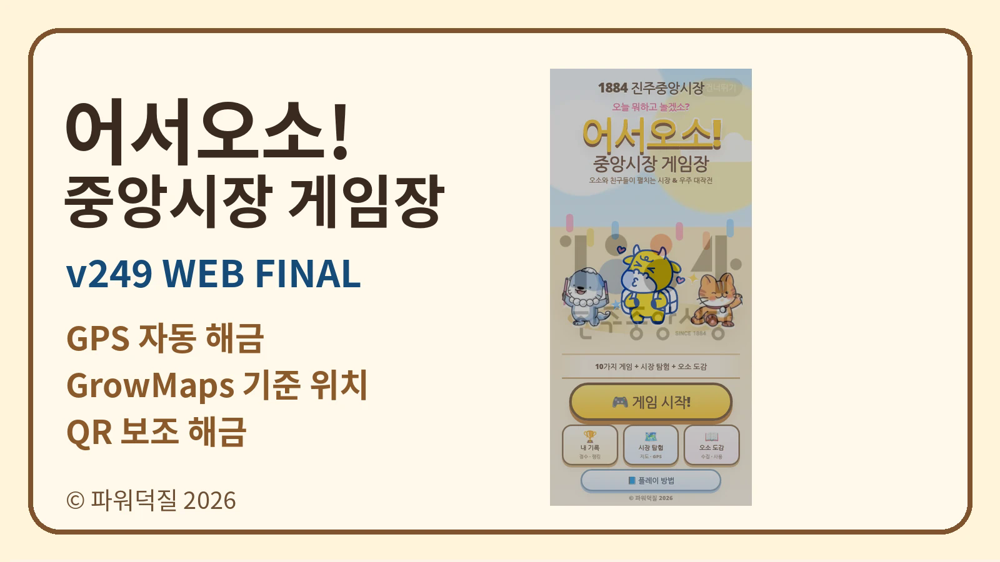

# 어서오소! 중앙시장 게임장 — v249 WEB FINAL

진주중앙시장을 직접 걸으며 GPS로 게임을 획득하고 플레이하는 **시장 스탬프 투어형 웹게임**입니다.
설치 없이 스마트폰 브라우저에서 실행하며, GrowMaps 기준 GPS 해금과 현장 QR 보조 해금을 사용합니다.

## 바로가기

- 🎮 **실전판:** https://haveanair.github.io/OSO-2026/play/
- 🔓 **운영자용 전체해금판:** https://haveanair.github.io/OSO-2026/unlock/
- ▣ **QR 모음:** https://haveanair.github.io/OSO-2026/qr/
- 🪧 **A4 현장 안내:** https://haveanair.github.io/OSO-2026/images/field-guide-a4.svg
- 📘 **웹 현장 매뉴얼:** https://haveanair.github.io/OSO-2026/manual/

## 기록 저장

참가자의 점수·게임 해금·진행 기록은 GitHub 서버에 공동 저장하지 않고 **각 스마트폰 브라우저의 localStorage**에 저장됩니다.
실전판과 전체해금판은 서로 다른 저장키를 사용하므로 테스트 기록과 행사 기록이 섞이지 않습니다.

## 현장 사용

HTTPS 접속 후 위치 권한을 허용합니다. 지정된 시장 구역에 진입하면 게임이 자동 해금되며, GPS 수신이 불안정한 경우 안내판의 QR을 보조 해금으로 사용할 수 있습니다.

© 파워덕질 2026
